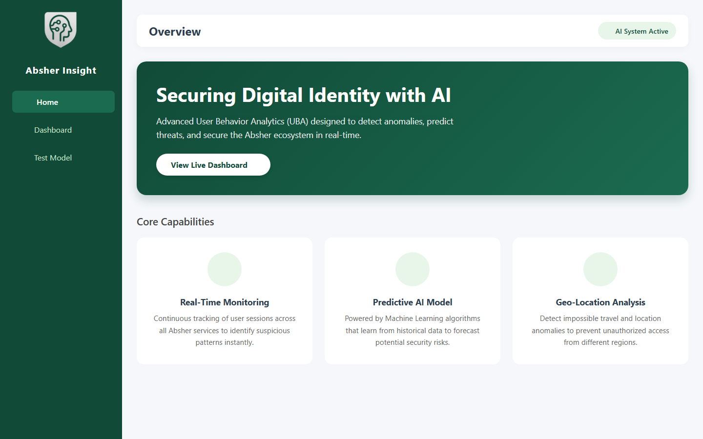
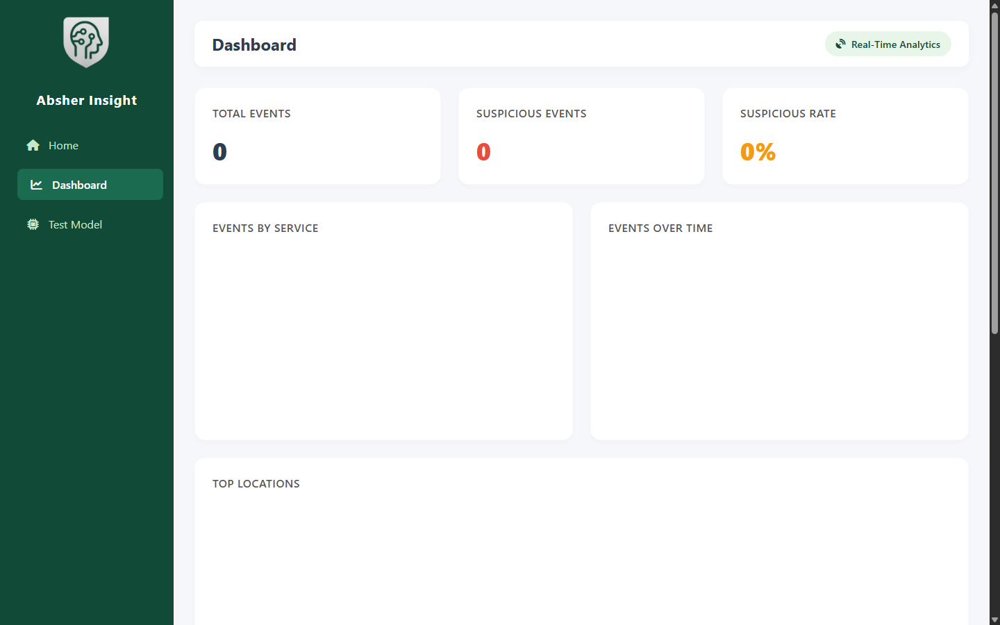

<p align="center">
  
</p>

# Absher Insight AI

[](https://github.com/Abdulel3h/absher-insight/actions/workflows/ci.yml)

Absher Insight AI is a proactive digital-security prototype that simulates behavioral risk detection for government-style digital services.

## Overview

The project combines a FastAPI backend, synthetic/in-memory event simulation, anomaly-style rules, dashboard views, and a small test harness. It is best presented as a privacy-by-design security analytics concept, not as a production security system.

## Documentation

- [Architecture](docs/architecture.md)
- [Case Study](docs/case-study.md)
- [Engineering Principles](docs/engineering-principles.md)
- [Technical Decisions](docs/technical-decisions.md)
- [Reviewer Guide](docs/reviewer-guide.md)
- [Testing and CI](docs/testing.md)

## Features

- `/predict` API for service, location, login time, and activity-count risk checks
- Rule-based suspicious-activity detection for unusual location, late-night access, and high action volume
- Live in-memory statistics for total events, suspicious events, top services, locations, and recent timeseries
- Background simulator to keep the dashboard active
- Static dashboard files for visualizing risk and activity
- Separate model inference utilities using joblib/scikit-learn artifacts

## Architecture

```text
Dashboard HTML/CSS/JS
  -> FastAPI backend
  -> /predict updates in-memory event state
  -> /api/stats exposes operational dashboard data
  -> optional joblib model utilities support anomaly-model experiments
```

## Tech Stack

- Python
- FastAPI
- Pydantic
- scikit-learn
- pandas
- NumPy
- joblib
- HTML, CSS, JavaScript

## Installation

```bash
cd backend
python -m venv .venv
. .venv/Scripts/activate
pip install -r requirements.txt
uvicorn main:app --reload
```

For tests:

```bash
pip install -r backend/requirements-test.txt
python -m pytest tests
```

Optional local environment:

```bash
ALLOWED_ORIGINS=http://localhost:8000,http://127.0.0.1:8000
ENABLE_SIMULATOR=1
```

Open the dashboard HTML files from `dashboard/` or serve them with a static server.

## Usage

```bash
curl -X POST http://localhost:8000/predict \
  -H "Content-Type: application/json" \
  -d "{\"service_type\":\"Traffic\",\"location\":\"Riyadh\",\"login_time\":\"10:15\",\"actions_count\":2}"
```

The current `/predict` response returns `prediction`, `probability`, and `details`.

## Screenshots





Captured from the committed dashboard HTML. Add API-backed normal, suspicious, and high-risk state captures after the backend simulator is running.

## System Design

- `backend/main.py` runs the FastAPI app, CORS, rules engine, simulator, and `/api/stats`.
- `backend/analytics.py` contains event aggregation helpers.
- `backend/inference.py` loads optional anomaly-model artifacts.
- `backend/models/` stores model files.
- `backend/data/` stores synthetic behavior data.
- `dashboard/` contains the browser dashboard.
- `tests/` contains an API test that should be aligned with the current response schema.

## Folder Structure

```text
backend/       FastAPI service, analytics, model inference, data, model files
dashboard/     Static frontend dashboard
tests/         API test harness
```

## Challenges

- The backend currently allows all CORS origins, which is acceptable for a prototype but not production.
- The simulator and stats are in-memory, so state resets on restart.
- The API test now checks the active `/predict` response schema.
- Committed model/data files should be reviewed for size, provenance, and privacy.

## Future Work

- Replace permissive CORS with explicit allowed origins.
- Add a persistent event store for reproducible analysis.
- Add tests for suspicious and normal scenarios.
- Add privacy and threat-model documentation.
- Add API-backed scenario screenshots and a short demo video.

## License

No license file is currently present. All rights are reserved by default unless a license is added.

## Author

Abdulelah Alkhathami

## Contact

- Website: [abdulelah.de](https://www.abdulelah.de)
- GitHub: [Abdulel3h](https://github.com/Abdulel3h)
