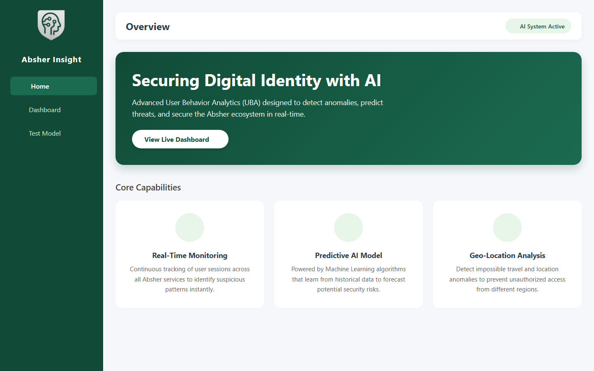
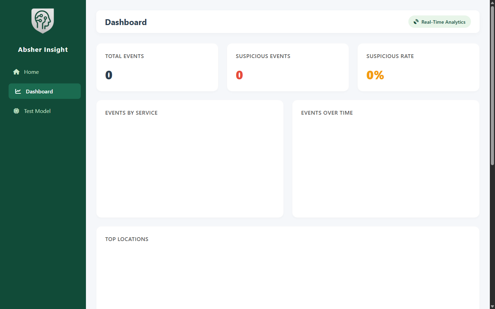

<picture>
  <source media="(max-width: 600px)" srcset="assets/branding/hero-mobile.svg">
  
</picture>

# Absher Insight

A behavioral-risk prototype for government-style digital services: it scores each access event against explainable rules and surfaces the unusual ones on an operational dashboard.

**Status: prototype, synthetic data.** Every event is synthetic or simulated in memory. This is an independent demonstration — **not affiliated with Absher or any government entity**, and not a deployed security system.

## Problem

Account-takeover signals in a citizen services platform are behavioural, not cryptographic: the same credentials used from an unusual place, at an unusual hour, at an unusual rate. An operations team needs to see that pattern and, just as importantly, needs to be told *why* an event was flagged.

## Solution

Absher Insight scores each access event with rules that state their own reasoning — unusual location, late-night access, high action volume — and keeps a live operational picture of what is happening across services. Explainability is the point: every flag comes back with the details that produced it.

## How it works

1. **Receive an event.** `POST /predict` takes service type, location, login time and action count.
2. **Apply explainable rules.** The rules engine checks unusual location, late-night access and high action volume.
3. **Answer with reasons.** The response carries `prediction`, `probability` and `details` — `probability` is assigned by those rules, not a calibrated model score.
4. **Aggregate.** In-memory state tracks totals, suspicious events, top services and locations, and a recent timeseries at `/api/stats`.
5. **Keep it moving.** An optional background simulator keeps the dashboard populated.

## Architecture

```text
Dashboard HTML/CSS/JS
  -> FastAPI backend
  -> /predict updates in-memory event state
  -> /api/stats exposes operational dashboard data
  -> optional joblib model utilities support anomaly-model experiments
```

| Component | Responsibility |
|---|---|
| `backend/main.py` | FastAPI app, CORS, rules engine, simulator, `/api/stats` |
| `backend/analytics.py` | Event aggregation helpers |
| `backend/inference.py` | Loads optional anomaly-model artifacts |
| `dashboard/` | Browser dashboard |
| `tests/` | API test covering the active `/predict` response schema |

## Trust and honesty about the numbers

- `probability` is **rule-assigned**, not a calibrated probability and not a measured accuracy score.
- Dashboard totals include synthetic initial state and simulated events.
- The service reads explicit CORS origins from `ALLOWED_ORIGINS` with localhost defaults.
- No real citizen data is used anywhere in this repository.

## Verified capabilities

- `/predict` risk check over service, location, login time and action count
- Rule-based detection for unusual location, late-night access and high action volume
- Live in-memory statistics: totals, suspicious events, top services and locations, recent timeseries
- Background simulator to keep the dashboard active
- Static dashboard for visualising risk and activity
- Separate joblib/scikit-learn inference utilities for anomaly-model experiments

## Screenshots





Captured from the committed dashboard HTML.

## Tech stack

Python · FastAPI · Pydantic · scikit-learn · pandas · NumPy · joblib

## Quick start

```bash
cd backend
python -m venv .venv
. .venv/Scripts/activate
pip install -r requirements.txt
uvicorn main:app --reload
```

Score an event:

```bash
curl -X POST http://localhost:8000/predict \
  -H "Content-Type: application/json" \
  -d "{\"service_type\":\"Traffic\",\"location\":\"Riyadh\",\"login_time\":\"10:15\",\"actions_count\":2}"
```

Run the tests:

```bash
pip install -r requirements-dev.txt
python -m pytest tests
```

Optional local environment:

```bash
ALLOWED_ORIGINS=http://localhost:8000,http://127.0.0.1:8000
ENABLE_SIMULATOR=1
```

Open the dashboard files from `dashboard/`, or serve them with a static server.

## Limitations

- **Synthetic only.** No real events, no production deployment, no affiliation with any government service.
- **Rules, not a trained detector.** The committed model artifacts support experiments; the live path is rule-based.
- **In-memory state.** The simulator and statistics reset on restart; there is no persistent event store.
- **Coverage.** Tests cover the `/predict` schema; suspicious and normal scenario coverage is still open.
- **Committed artifacts.** Model and data files should be reviewed for size, provenance and privacy.

## Repository structure

```text
backend/       FastAPI service, analytics, model inference, data, model files
dashboard/     Static frontend dashboard
tests/         API test harness
```

## Documentation

[Architecture](docs/architecture.md) · [Case study](docs/case-study.md) · [Engineering principles](docs/engineering-principles.md) · [Technical decisions](docs/technical-decisions.md) · [Reviewer guide](docs/reviewer-guide.md) · [Branding assets](assets/branding/README.md)

## License

No license file is currently present. All rights are reserved by default unless a license is added.

## Contact

**Abdulelah Alkhathami** · [Portfolio](https://abdulelah.de) · [GitHub](https://github.com/Abdulel3h) · [Email](mailto:me@abdulelah.de)
