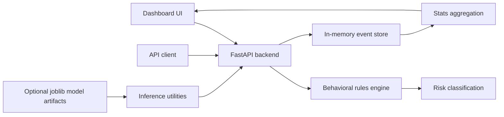

# Absher Insight AI Architecture

Absher Insight AI is a proactive digital-security analytics prototype. It uses synthetic behavior data, rule-based suspicious-activity checks, and dashboard APIs to explore risk detection without exposing real user data.

## System Flow

## Key Design Decisions

- Use synthetic activity patterns so the repository can stay public.
- Keep the first version explainable through clear rules for location, time, and activity volume.
- Expose dashboard statistics separately from prediction responses.
- Document the prototype boundary so it is not mistaken for a production security system.

## Production Gaps

- Replace permissive CORS with explicit allowed origins.
- Persist events in a real datastore for auditability and reproducibility.
- Add tests for normal, suspicious, and high-risk scenarios.
- Add a privacy and threat-model document before any real deployment.
